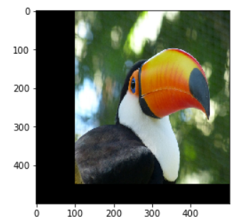
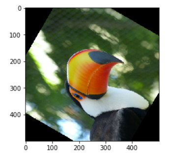
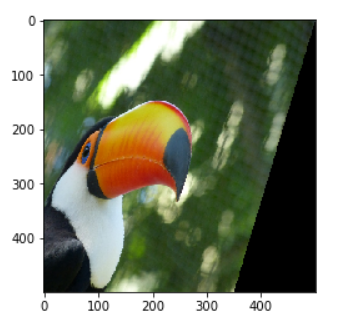
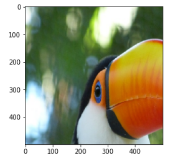
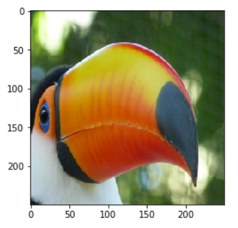
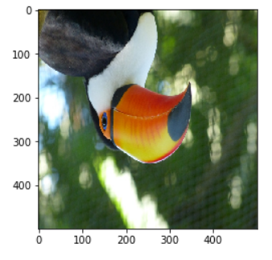
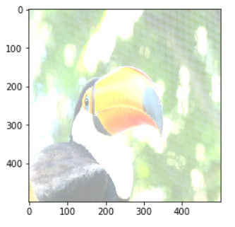
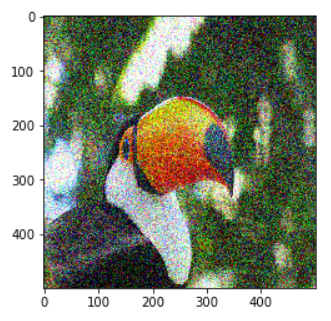

# Data Augmentation to increase your Dataset size

## Why

Data augmentation is an integral process in deep learning, as in deep learning we need large amounts of data and in some cases it is not feasible to collect thousands or millions of images, so data augmentation comes to the rescue.

It helps us to increase the size of the dataset and introduce variability in the dataset.

## Operations

### **Translation**   

### **Rotation**   

### **Shearing**

#### ShearX

#### ShearY

### **Scaling**

### **Cropping**
Selecting a specific area from image   

### **Flipping**
Use this carefully because it might not make much sense, e.g. a face, a person will not be upside down to a camera.   

### **Changing** the brightness level

### **Gaussian** Noise

### **Advanced ones**

- Use **generators** or **neural networks** to alter the image domain, e.g. make a photo taken in summer look like it was taken in winter
- Filling empty space on an image after a rotation, translation, etc using interpolation. This is achieved using:
  - **Constant**: The simplest interpolation method is to fill the unknown region with some constant value. This may not work for natural images, but can work for images taken in a monochromatic background
  - **Edge**: The edge values of the image are extended after the boundary. This method can work for mild translations.
  - **Reflect**: The image pixel values are reflected along the image boundary. This method is useful for continuous or natural backgrounds containing trees, mountains etc.
  - **Symmetric**: This method is similar to reflect, except for the fact that, at the boundary of reflection, a copy of the edge pixels are made. Normally, reflect and symmetric can be used interchangeably, but differences will be visible while dealing with very small images or patterns.
  - **Wrap**: The image is just repeated beyond its boundary, as if it’s being tiled. This method is not as popularly used as the rest as it does not make sense for a lot of scenarios.

Constant, Edge, Reflect, Symmetric and Wrap

## Useful Links

[GeeksforGeeks - Python Data Augmentation](https://www.geeksforgeeks.org/python-data-augmentation/)   
[tutorialspoint - 2D Transformations](https://www.tutorialspoint.com/computer_graphics/2d_transformation.htm)   
[Nanonets - Data Augmentation | How to use Deep Learning when you have Limited Data](https://nanonets.com/blog/data-augmentation-how-to-use-deep-learning-when-you-have-limited-data-part-2/)